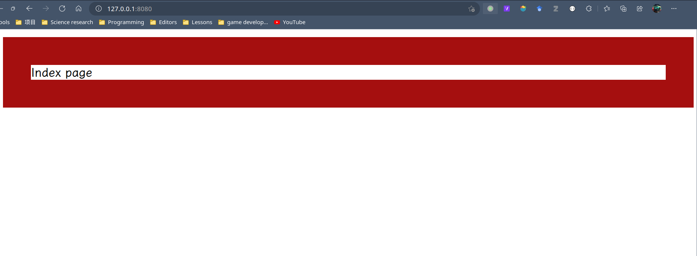

# What is it

使用 Linux epoll 和 socket API 编写 HTTP Server。

该 Server 使用 socket API 与 Http client 交换信息，使用 epoll 实现 I/O 多路复用。

## Use it

```sh
$ mkdir build
$ cd build
$ cmake ../
Generate build files.
$ cmake --build .
Build.
$ ./src/run
Run.
```

然后打开 `127.0.0.1:8080` 即可查看：



Benchmark: To be added. 目前考虑使用 https://github.com/frevib/io_uring-echo-server/blob/io-uring-feat-fast-poll/benchmarks/benchmarks.md
